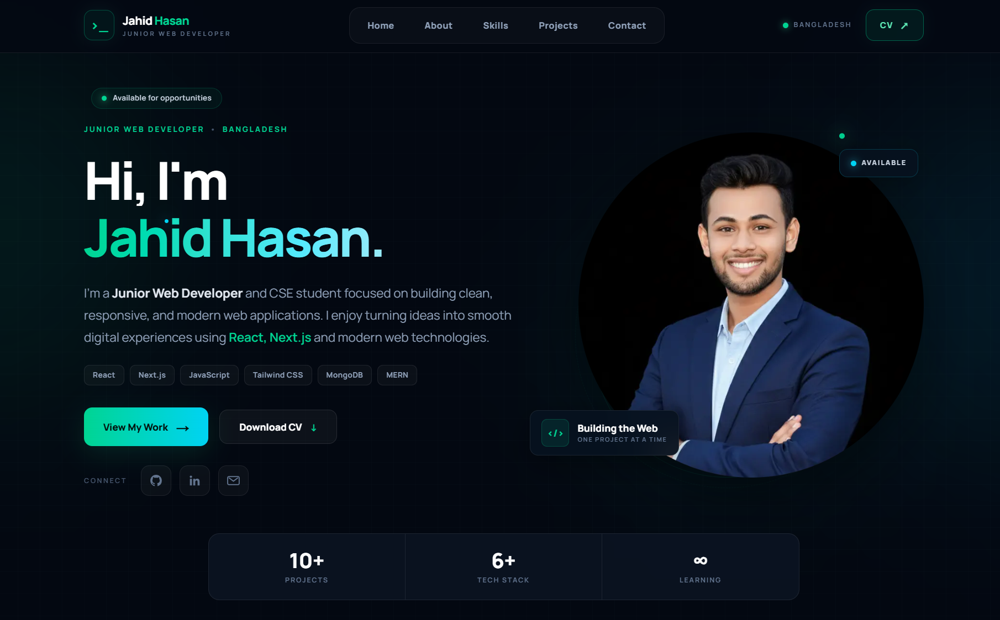

# 🚀 Jahid Hasan - Personal Portfolio Website

[Live Demo](https://jahid-portfolio-bay.vercel.app)
[](https://github.com/your-username/your-repo-name)
[](https://nextjs.org/)
[](https://tailwindcss.com/)

A modern, fast, and fully responsive personal portfolio website built with **Next.js**, **Tailwind CSS**, and **Framer Motion**. It highlights my journey, featured web projects, technical skill set, and contact options.

---

## 🔗 Quick Links

* **🌐 Live Preview:** [portfolio](https://jahid-portfolio-bay.vercel.app)
* **💻 GitHub Repository:** [github](https://github.com/jahidhasan-devs/My-Portfolio)

---

## 📸 Project Screenshot

<p align="center">
  
</p>

> 💡 *Note: Place your screenshot inside an `assets` folder named `preview.png` or drag & drop the image directly into the GitHub README editor to auto-generate a link.*

---

## ✨ Features

* 💎 **Glassmorphism UI:** Modern dark theme design with emerald accents.
* 📱 **Fully Responsive:** Smooth layout transitions optimized for Mobile, Tablet, and Desktop.
* ⚡ **Interactive Animations:** Micro-interactions and smooth component entrances using **Framer Motion**.
* 📄 **In-App CV Modal Viewer:** Live PDF viewing window with direct download access.
* 📬 **Contact Section:** Direct connections to social networks and interactive touchpoints.

---

## 🛠️ Tech Stack

* **Frontend:** React.js, Next.js (App Router)
* **Styling:** Tailwind CSS
* **Animations:** Framer Motion
* **Icons:** Lucide React / React Icons
* **Deployment:** Vercel

---

## 📂 Directory Structure

```text
├── public/              # Static assets (CV PDF, icons, public images)
├── src/
│   ├── app/             # Next.js App Router structure
│   ├── components/      # UI Components (Navbar, Hero, Projects, Skills, Modal)
│   └── styles/          # Global CSS & Tailwind styles
├── package.json
└── README.md